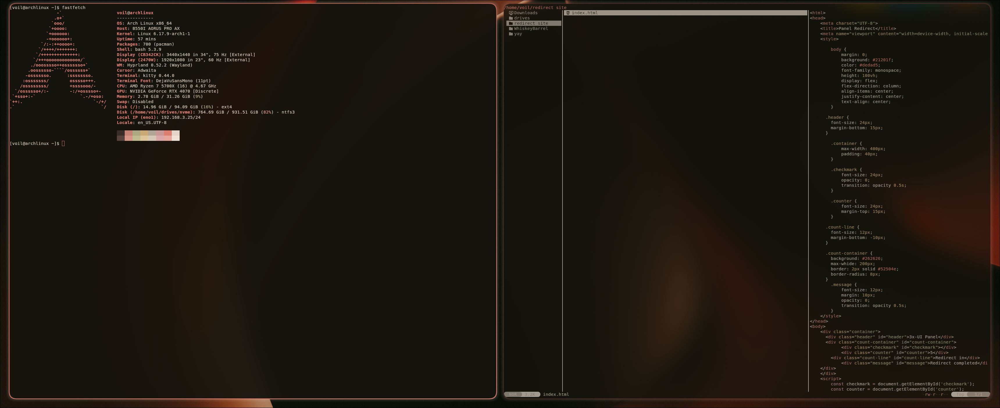
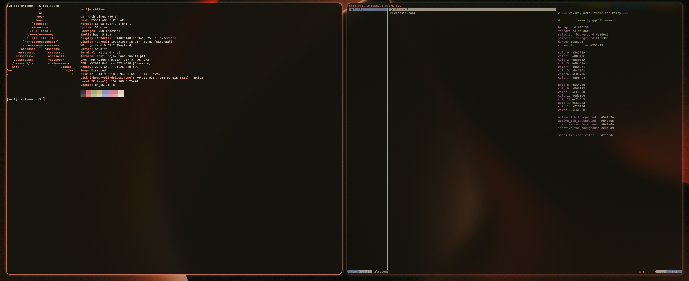

# Theme for kitty terminal
*by qqvoil*

## Versions:

### Alternative colours:

### Classic colours:

## Installation:
1. Copy file to `~/.config/kitty/`
2. Rename to `current-theme.conf` and overwrite it
3. Done!
